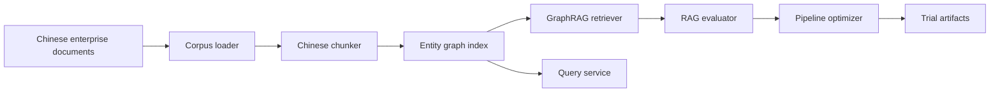

# Architecture

`cn-graphrag-eval-opt` is organized as a small but complete RAG experiment system.

## Workflow

## Design References

- GraphRAG: explicit project initialization, indexing, querying, and responsible artifact production.
- LightRAG: lightweight graph retrieval modes for local/global/hybrid reasoning.
- AutoRAG: trial-oriented configuration search and leaderboard output.
- Ragas: metric vocabulary for judging context and answer quality.
- R2R: query responses include context traces rather than only generated text.

## Extension Points

- Replace lexical retrieval with dense embeddings or BM25 in `retrieval.py`.
- Persist indexes to SQLite, NetworkX, Neo4j, Qdrant, or another store behind `GraphIndex`.
- Replace deterministic answer synthesis with an LLM-backed generator.
- Swap proxy metrics for Ragas model-backed metrics when credentials are available.
- Expose `QueryService` through FastAPI for a production-style HTTP surface.
